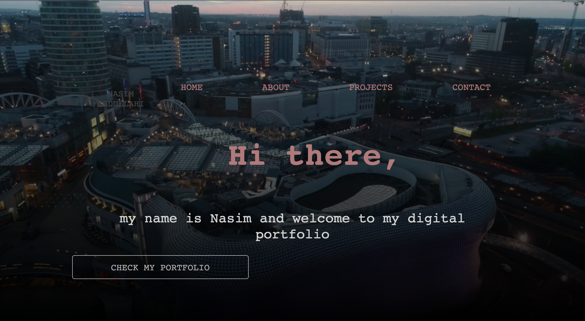
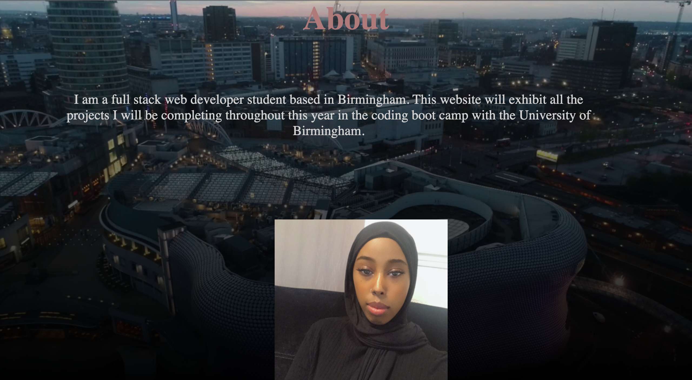
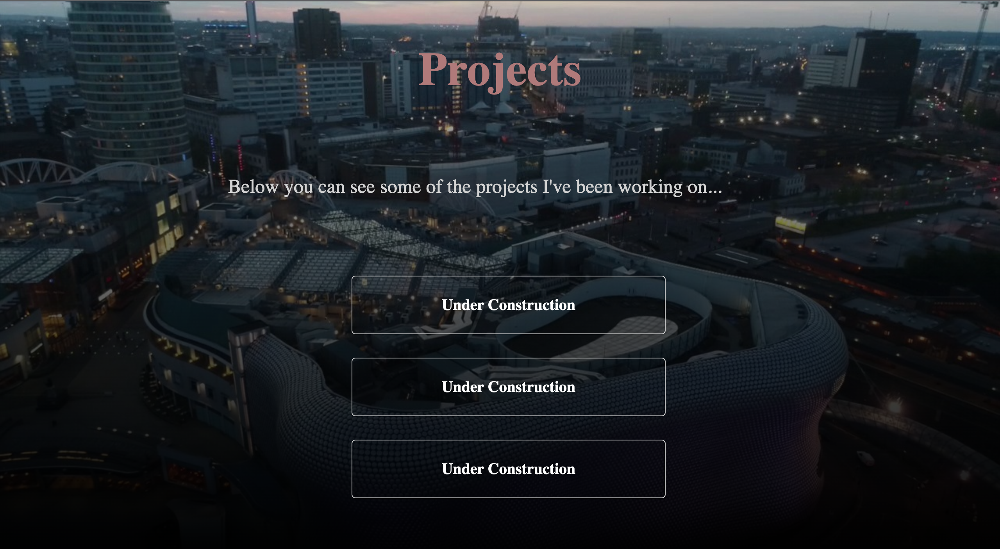

# Nasim's Portfolio

I have been given a task to create a web application from scratch where I have built a portfolio page that I can add to as the course progresses.

To create this application, I have used tech such as html and css. To do this I have applied the knowledge I have gained so far from UOB's bootcamp.

Because I do not have enough web applications to showcase on my web page, I have added placeholder names so that i can change them to real ones once I start creating them later in the course.

Here are the screenshots of the web application live:

Here are the links to my git hub and webpage:

https://github.com/NazAbdul/Portfolio

file:///Users/admn/Desktop/bootcamp/Portfolio/index.html
